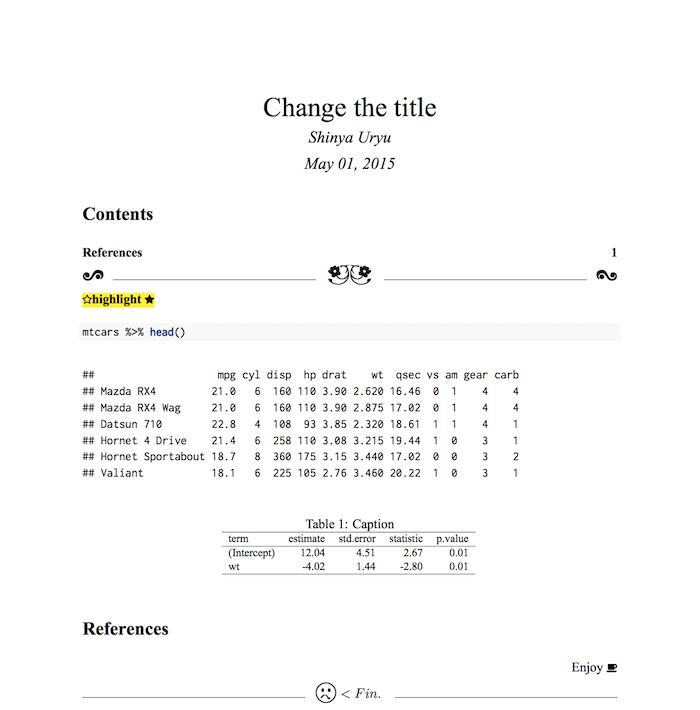
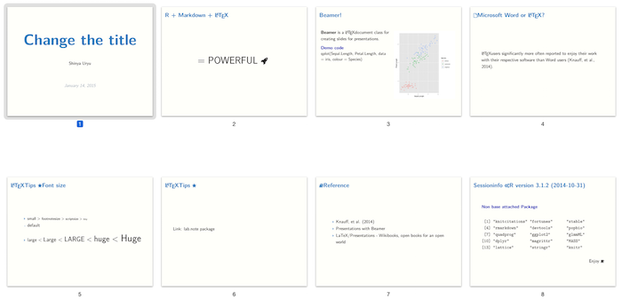
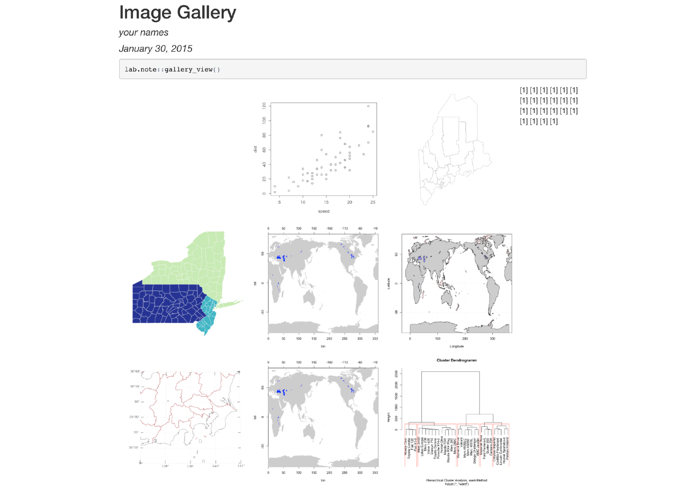

The `lab.note` package is .Rmd file that customise template for writing reproducible document (ex. report, presentation).

# 

# Usage

## From RStudio

1. File -> New File -> R Markdown...
2. From template... loading template files
3. Choose Laboratory note and report (PDF)

## From console

```{r, eval = FALSE}
rmarkdown::draft("MyReport.Rmd", template = "report", package = "lab.note")
```

# Templates

## report (PDF)

The `report` template is custom R Markdown file contains useful R and LaTeX packages. You can more customise it.



## seminor (PDF) and light talk

These templates are outout as beamer PDF that more flexible presentation file.



## image gallery (HTML)

In project folder, exist many image files. The `image gallery` template listup and display these files.


